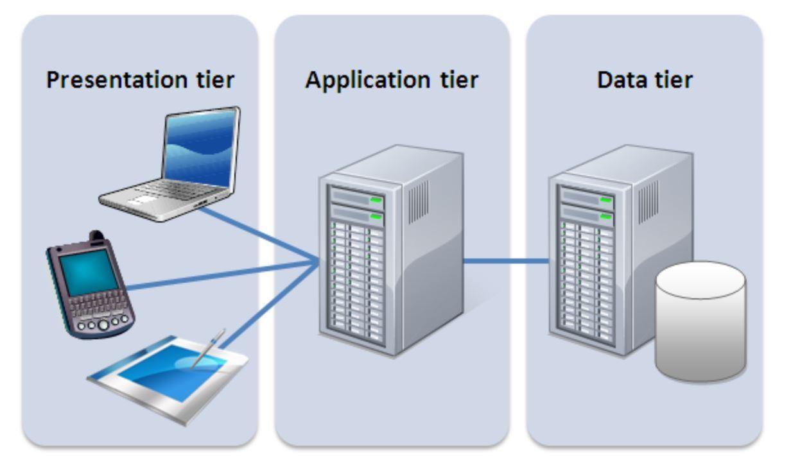
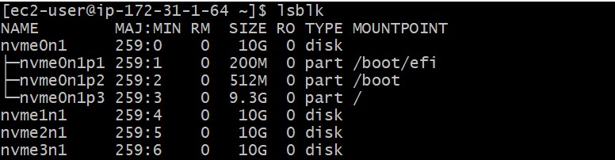
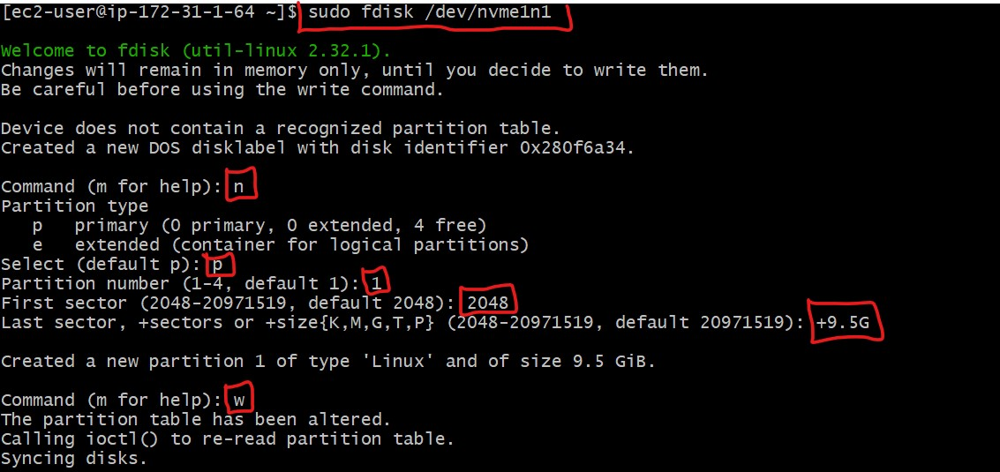
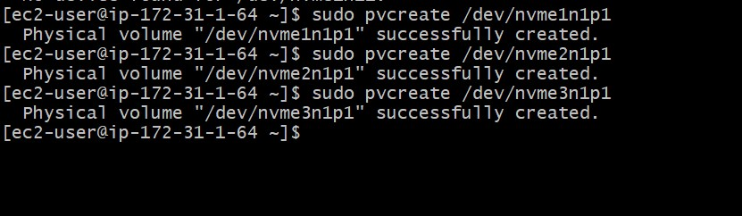
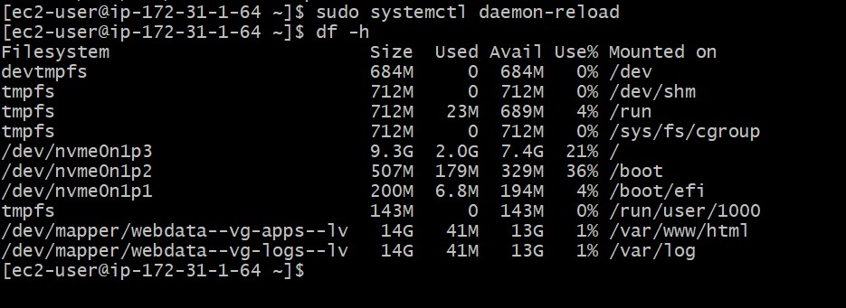
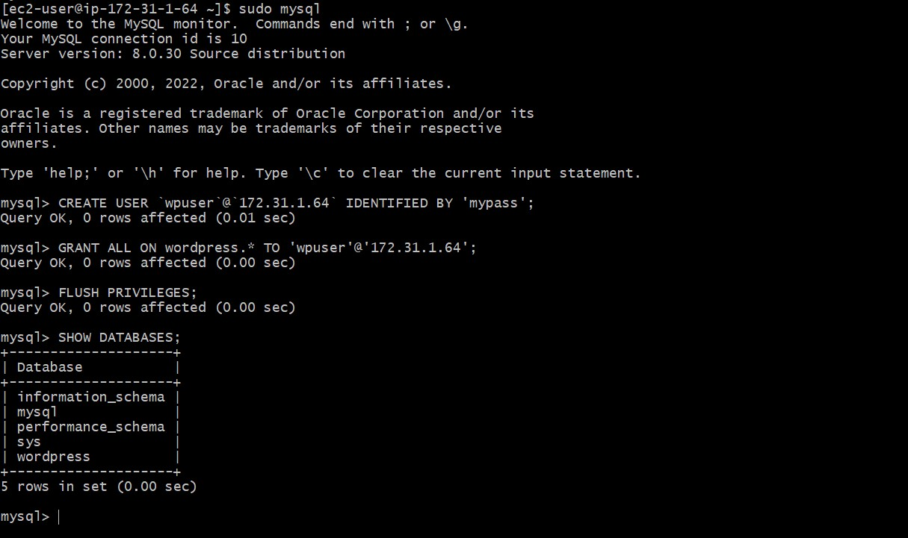
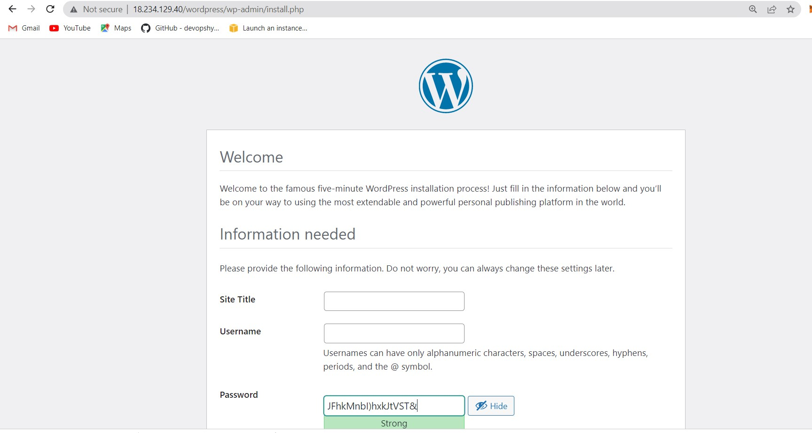
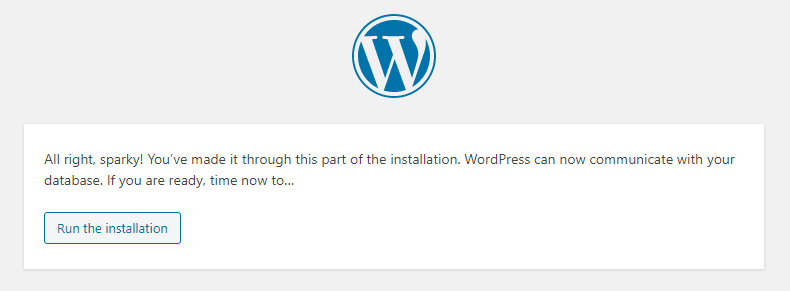
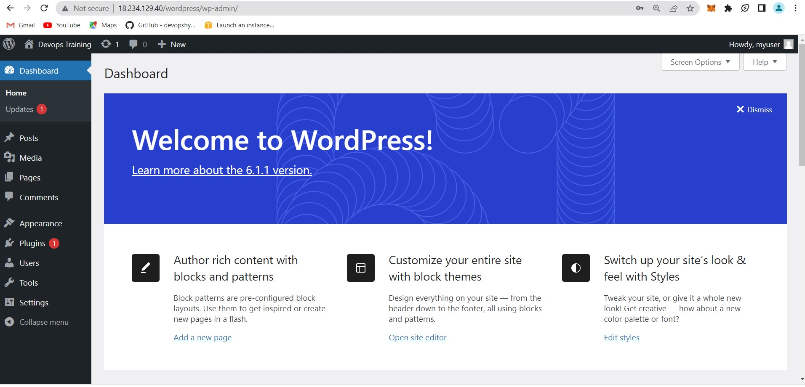

## WEB SOLUTION WITH WORDPRESS

This repository explains the steps involved in preparing storage infrastructure on two Linux servers and implementing a basic web solution using WordPress.

You will gain practical experience that demonstrates three-tier architecture while also making sure that the Linux servers' storage disks are properly partitioned and maintained using tools like gdisk and LVM, respectively.

## The 3-Tier Setup

1. A Laptop or PC to serve as a client
2. A REDHAT EC2 Linux Server as a web server (This is where you will install WordPress)
3. A REDHAT EC2 Linux server as a database (DB) server

Generally, web, or mobile solutions are implemented based on what is called the Three-tier Architecture. Three-tier Architecture is a client-server software architecture pattern that comprise of 3 separate layers.

1. Presentation Layer (PL): This is the user interface such as the client server or browser on your laptop.
2. Business Layer (BL): This is the backend program that implements business logic. Application or Webserver
3. Data Access or Management Layer (DAL): This is the layer for computer data storage and data access. Database Server or File System Server such as FTP server, or NFS Server.

## LAUNCH AN EC2 INSTANCE THAT WILL SERVE AS “WEB SERVER”.

# Step 1 — Prepare a Web Server

1.	Launch an EC2 instance that will serve as "Web Server". Create 3 volumes in the same AZ as your Web Server EC2, each of 10 GiB.

2.	Attach all three volumes one by one to your Web Server EC2 instance

3.	Open up the Linux terminal to begin configuration. Use `lsblk` command to inspect what block devices are attached to the server. Notice names of your newly created devices. All devices in Linux reside in /dev/ directory. Inspect it with `ls /dev/` and make sure you see all 3 newly created block devices there – their names will likely be nvme1n1, nvme2n1, nvme3n1.

4. Use df -h command to see all mounts and free space on your server

5.	Use fdisk utility to create a single partition on each of the 3 disks sudo fdisk /dev/nvme1n1

6. Use lsblk utility to view the newly configured partition on each of the 3 disks.

7. Install lvm2 package using `sudo yum install lvm2`. Run sudo lvmdiskscan command to check for available partitions.
*Note: yum is the package installer for RedHat/CentOS*

8. Use `pvcreate` utility to mark each of 3 disks as physical volumes (PVs) to be used by LVM
 
`sudo pvcreate /dev/nvme1n1p1`

`sudo pvcreate /dev/nvme2n1p1`

`sudo pvcreate /dev/nvme3n1p1`

9. Verify that your Physical volume has been created successfully by running `sudo pvs`

10. Use vgcreate utility to add all 3 PVs to a volume group (VG). Name the VG webdata-vg
`sudo vgcreate webdata-vg /dev/nvme1n1p1 /dev/nvme2n1p1 /dev/nvme3n1p1`

11. Verify that your VG has been created successfully by running `sudo vgs`

12. Use `lvcreate` utility to create 2 logical volumes. apps-lv (Use half of the PV size), and logs-lv Use the remaining space of the PV size. *NOTE: apps-lv will be used to store data for the Website while, logs-lv will be used to store data for logs.*

`sudo lvcreate -n logs-lv -L 14G webdata-vg`

13. Verify that your Logical Volume has been created successfully by running `sudo lvs`

14. Verify the entire setup `sudo vgdisplay -v #view complete setup - VG, PV, and LV`

`sudo lsblk`

15. Use mkfs.ext4 to format the logical volumes with ext4 filesystem

`sudo mkfs -t ext4 /dev/webdata-vg/apps-lv && sudo mkfs -t ext4 /dev/webdata-vg/logs-lv`

16. Create /var/www/html directory to store website files

`sudo mkdir -p /var/www/html`

17. Create /home/recovery/logs to store backup of log data

`sudo mkdir -p /home/recovery/logs`

18. Mount /var/www/html on apps-lv logical volume

`sudo mount /dev/webdata-vg/apps-lv /var/www/html/`

19. Use rsync utility to back up all the files in the log directory /var/log into /home/recovery/logs *(This is required before mounting the file system)*

`sudo rsync -av /var/log/. /home/recovery/logs/`

20. Mount /var/log on logs-lv logical volume. *(Note that all the existing data on /var/log will be deleted. That is why step 15 above is very important)*

`sudo mount /dev/webdata-vg/logs-lv /var/log`

21. Restore log files back into /var/log directory

`sudo rsync -av /home/recovery/logs/. /var/log`

22. Update /etc/fstab file so that the mount configuration will persist after restart of the server.

The UUID of the device will be used to update the /etc/fstab file; `sudo blkid`

`sudo vi /etc/fstab` *Note: you have to install nano text editor first using `sudo yum install vi`

23. Test the configuration and reload the daemon

`sudo systemctl daemon-reload`

24. Verify your setup by running df -h, output must look like this:

## STEP 2 - PREPARE THE DATABASE SERVER

Launch a second RedHat EC2 instance that will have a role – ‘DB Server’ Repeat the same steps as for the Web Server, but instead of apps-lv and logs-lv, create db-lv and logs-lv, then mount it to /db directory instead of /var/www/html/.

## STEP 3 - INSTALL WORDPRESS ON YOUR WEB SERVER

1. Update the repository

`sudo yum -y update`

2. Install wget, Apache and it’s dependencies

`sudo yum -y install wget httpd php php-mysqlnd php-fpm php-json`

3. Start Apache

`sudo systemctl start httpd && sudo systemctl enable httpd`

4. To install PHP and its depemdencies

`sudo yum install yum-utils http://rpms.remirepo.net/enterprise/remi-release-8.rpm`

`sudo yum module list php`

`sudo yum module reset php`

`sudo yum module enable php:remi-7.4`

`sudo yum install php php-opcache php-gd php-curl php-mysqlnd`

`sudo systemctl start php-fpm`

`sudo systemctl enable php-fpm`

`setsebool -P httpd_execmem 1`

5. Restart Apache `sudo systemctl restart httpd`

6. Download wordpress and copy wordpress to var/www/html

`mkdir wordpress`

`cd   wordpress`

`sudo wget http://wordpress.org/latest.tar.gz`

`sudo tar xzvf latest.tar.gz`

`sudo rm -rf latest.tar.gz`

`sudo cp wordpress/wp-config-sample.php wordpress/wp-config.php`

`sudo cp -R wordpress /var/www/html/`

7. Configure SELinux Policies

`sudo chown -R apache:apache /var/www/html/wordpress`

`sudo chcon -t httpd_sys_rw_content_t /var/www/html/wordpress -R`

`sudo setsebool -P httpd_can_network_connect=1`

`sudo setsebool -P httpd_can_network_connect_db 1`

## STEP 4 - INSTALL MYSQL ON YOUR DB SERVER

`sudo yum install mysql-server`

Verify that the service is up and running by using `sudo systemctl status mysqld`, if it is not running, restart the service and enable it so it will be running even after reboot:

`sudo systemctl restart mysqld`
`sudo systemctl enable mysqld`

## STEP 5 - CONFIGURE DB TO WORK WITH WORDPRESS

`CREATE DATABASE wordpress;`

`CREATE USER `myuser`@`<Web-Server-Private-IP-Address>` IDENTIFIED BY 'mypass';`

`GRANT ALL ON wordpress.* TO 'myuser'@'<Web-Server-Private-IP-Address>';`

`FLUSH PRIVILEGES;`

`SHOW DATABASES;`

`exit`

## STEP 6 - CONFIGURE WORDPRESS TO CONNECT TO THE REMOTE DATABASE
**Hint: Do not forget to open MySQL port 3306 on DB Server EC2. For extra security, you shall allow access to the DB server ONLY from your Web Server’s IP address, so in the Inbound Rule configuration specify source as /32**

1. Install MySQL client and test that you can connect from your Web Server to your DB server by using mysql-client

`sudo yum install mysql`

2. Now edit mysql configuration file by typing sudo vi /etc/my.cnf. Add the following at the end of the file.

**Now, restart mysqld service using `sudo systemctl restart mysqld`**

3. Change permissions and configuration so Apache could use WordPress:

4. Enable TCP port 80 in Inbound Rules configuration for your Web Server EC2 (enable from everywhere 0.0.0.0/0 or from your workstation’s IP)

5. On the web server, edit wordpress configuration file.

`cd /var/www/html/wordpress`

 `sudo nano wp-config.php`

6. Disable the default page of apache so that you can view the wordpress on the internet.

`sudo mv /etc/httpd/conf.d/welcome.conf /etc/httpd/conf.d/welcome.conf_backup`

6. Restart httpd. `sudo systemctl restart httpd`

8. Verify if you can successfully execute SHOW DATABASES; command and see a list of existing databases.

`sudo mysql -u admin -p -h <DB-Server-Private-IP-address>`

9. Change permissions and configuration so Apache could use WordPress:

`sudo chcon -t httpd_sys_content_t /var/www/html/wordpress -R`

`sudo setsebool -P httpd_can_network_connect=1`

`sudo setsebool -P httpd_can_network_connect_db 1`

10. Try to access from your browser the link to your WordPress 

http://Web-Server-Public-IP-Address/wordpress/

- Fill in your credentials to setup your account for your wordpress website. If you see this message – it means your WordPress has successfully connected to your remote MySQL database.

Log in with your username and password

**CONGRATULATIONS!!!**

- You have learned how to configure Linux storage susbystem and have also deployed a full-scale Web Solution using WordPress CMS and MySQL RDBMS.